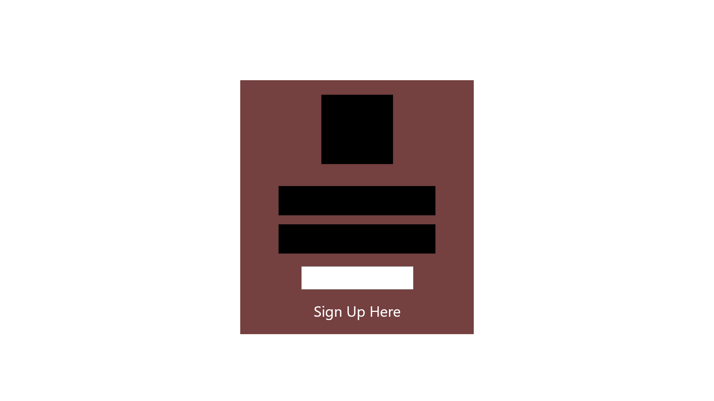
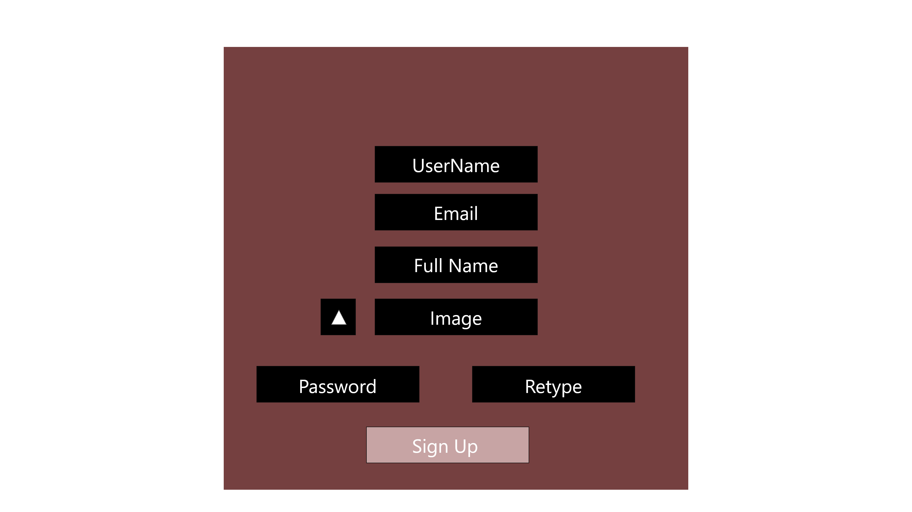
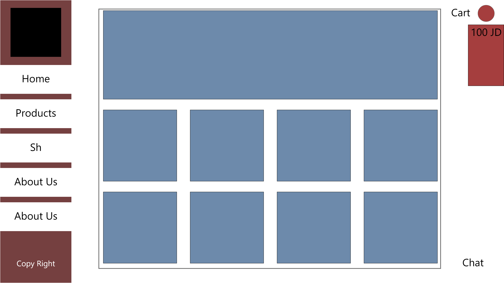
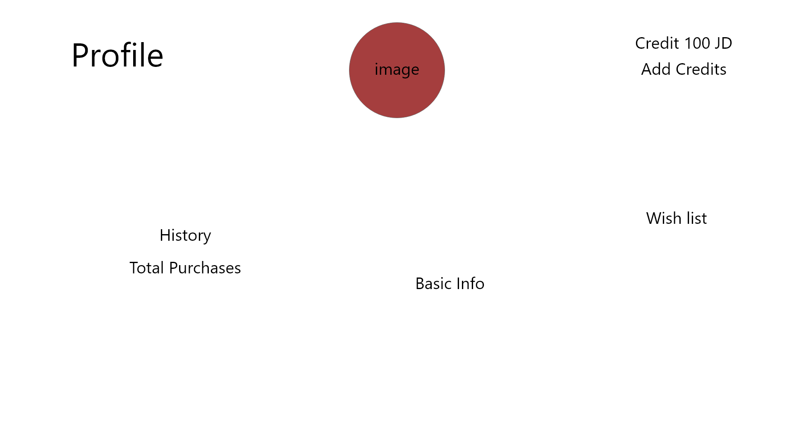

# 401-midterm-project
## Project Name
&nbsp;
&nbsp;
&nbsp;

## Team Members
• **Rahaf Al-Jazzazi**

• **Mohammad Alzoubi**

• **Doaa Daban**

• **Osaid Alhomedy**

• **Tariq Hasan Zeadeh**

• **Hatem Sallam**

• **Anas Dlalah**

## Cooperation Plan
- All team members have variety of abilities and skills, but these are the key strengths for each (Enthusiasm, Creativity, Patience ,Teamwork).

- A team member who is good at "communicating" is always helpful in connecting the dots to a final result with the help of a" detail oriented " member to help him/her to connect the dots correctly. As every team member is unique in one strength but all members should know and understand the full aspects of the project in which case a daily meeting with all the team members should be held to follow up and check on the progress of the project.

&nbsp;

## Conflict Plan
As a team we have agreed on our main working hours as it will be the lab time during the lecture time and we made another working schedule to continue our work after the lap time, we will have 10 min break every hour, and 1 hour for lunch break.

Our day off will be on Friday to have a good rest and study more. As we will use (ZOOM & Discord) during the lab time and (Slack) too, as communication tools to ensure that everyone will share their thoughts.

&nbsp;

## Communication Plan

&nbsp;

## Work Plan

&nbsp;

## Git Process
We will create an organizations in Github and create the project repository and shared it on GitHub as well as clone it on our individual devices to start the work, each one of us will use a branch to work on it, we will push our work on the development branch at the end of each day.(Merge Party)

&nbsp;

## Landing Pages 
- Login in page

- Sign up 

- Home page 

- Profile

